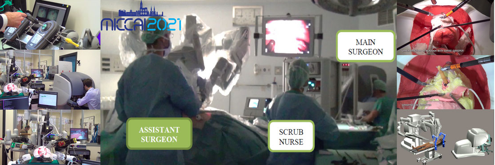
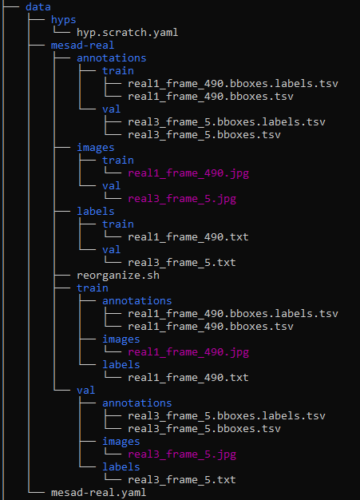
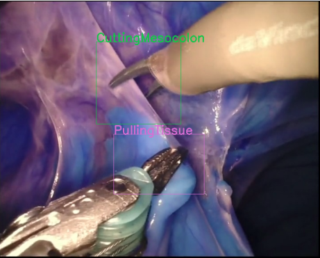

# A Yolov5 model for surgery action detection
This repository includes code on the development of Yolov5 object detection model for surgery action detection. The Yolov5 model was developed by Utralytics and is available at https://github.com/ultralytics/yolov5 .

## Dataset information

The dataset is a subset from the SARAS-MESAD 2021 challenge available at https://saras-mesad.grand-challenge.org/ . 

## Training and inference

The data directory structure of this repository is shown below:

The 'data' folder contains the extracted 'mesad-real' dataset with 'train' and 'val' folders containing the 'annotations' and 'images' sub-folders. The annotations directory includes .tsv files and the images directory includes .jpg images.

The 'pre_processing.pynb' notebook is used to convert the mesad-real annotations to the yolo format. Running this notebook results in the creation of the labels directory with each annotation in .txt yolov5 format. The notebook also creates a  'mesad-real.yaml' file that includes the information about the data paths and the classes in the dataset.

After successfully running the notebook, the 'reorganize.sh' bash script can be run to reorganize the folder structure as desired by yolov5. The script creates separate sub-folders 'annotations', 'images' and 'labels' under the 'mesad-real' folder which include all the relevant files.

The 'training_yolo.ipynb' notebook can then be run, to train the yolov5 model.

For further data augmentation strategies and tuning hyperparameters, visit  https://github.com/ultralytics/yolov5.

## Output
An example of the  prediction is shown below:

  | 

## References
@misc{bawa2021saras,
      title={The SARAS Endoscopic Surgeon Action Detection (ESAD) dataset: Challenges and methods}, 
      author={Vivek Singh Bawa and Gurkirt Singh and Francis KapingA and Inna Skarga-Bandurova and Elettra Oleari and Alice Leporini and Carmela Landolfo and Pengfei Zhao and Xi Xiang and Gongning Luo and Kuanquan Wang and Liangzhi Li and Bowen Wang and Shang Zhao and Li Li and Armando Stabile and Francesco Setti and Riccardo Muradore and Fabio Cuzzolin},
      year={2021},
      eprint={2104.03178},
      archivePrefix={arXiv},
      primaryClass={cs.CV}
}

@misc{bawa2020esad,
      title={ESAD: Endoscopic Surgeon Action Detection Dataset}, 
      author={Vivek Singh Bawa and Gurkirt Singh and Francis KapingA and Inna Skarga-Bandurova and Alice Leporini and Carmela Landolfo and Armando Stabile and Francesco Setti and Riccardo Muradore and Elettra Oleari and Fabio Cuzzolin},
      year={2020},
      eprint={2006.07164},
      archivePrefix={arXiv},
      primaryClass={cs.CV}
}
